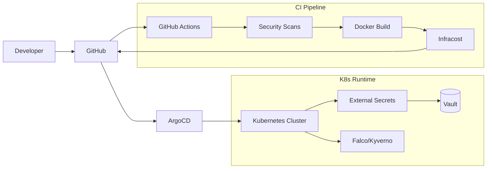

# DevSecOps Portfolio Lab

A comprehensive, interview-ready portfolio demonstrating DevSecOps best practices, Infrastructure as Code, and Kubernetes orchestration.

## 🏗 Architecture

See [docs/architecture.md](docs/architecture.md) for more details.



## 📂 Project Structure

- `app/`: FastAPI microservice with health/metrics endpoints.
- `.github/workflows/`: Production-grade GitHub Actions CI pipeline.
- `scripts/scan.sh`: Unified local DevSecOps scanning script.
- `helm/demo-app/`: Security-hardened Helm chart (non-root, read-only FS).
- `k8s/`: Governance layer with Kyverno policies and NetworkPolicies.
- `terraform/`: IaC skeletons for Yandex Cloud provisioning.
- `ansible/`: Configuration management for k3s clusters.
- `security/`: Configuration for Falco, Gitleaks, and Checkov.

## 🚀 Key Features

### 1. Automated CI/CD Pipeline
- **GitHub Actions**: Fully automated pipeline with Linting, Testing, and Security gates.
- **Fail-Fast Security**: Pipeline fails if Gitleaks (secrets), Trivy (CVEs), or Checkov (IaC) detect issues.

### 2. "Shift Left" Security
- **Local Scanning**: Unified `scripts/scan.sh` for developers to run Gitleaks, Trivy, and Checkov locally.
- **IaC Hardening**: Terraform manifests validated against security benchmarks.

### 3. K8s Governance & Runtime
- **Kyverno**: Native policy engine enforcing resource limits and non-root execution.
- **Falco**: Runtime security monitoring with custom rules for detecting suspicious activity.
- **NetworkPolicy**: Default-deny posture for zero-trust networking.

### 4. Observability & Monitoring
- **Prometheus**: Application instrumented to expose `/metrics` for scraping via ServiceMonitor.
- **Grafana**: Pre-configured dashboard (`monitoring/grafana-dashboard.json`) for visualizing application health and performance.

## 🛠 Usage

### Local Security Scan
```bash
./scripts/scan.sh all
```

### Application Health Check
```bash
curl http://localhost:8000/health
```

### K8s Policy Audit
```bash
kubectl get policyreport -A
```

## 🎤 Interview Positioning
This project is designed to demonstrate:
- **Automation First**: Moving from manual checks to automated GitHub Actions.
- **Security-as-Code**: Managing Falco rules and Kyverno policies alongside application code.
- **Operational Rigor**: Comprehensive logging, metrics, and health checks.

---
*Created as part of a DevOps Learning Path.*
