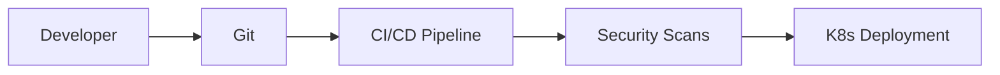

# DevOps Portfolio Lab

A comprehensive, interview-ready portfolio demonstrating DevSecOps best practices, Infrastructure as Code, and Kubernetes orchestration.

## 🏗 Architecture

See [docs/architecture.md](docs/architecture.md) for more details.



## 📂 Project Structure

- `app/`: FastAPI demo application.
- `terraform/`: Infrastructure provisioning (Yandex Cloud).
- `ansible/`: Configuration management (k3s installation).
- `helm/`: Kubernetes deployment manifests.
- `k8s/`: Low-level manifests (Namespace, NetworkPolicy, Kyverno).
- `security/`: Security configurations and policies.

## 🚀 Quick Start

### 1. Application (Docker)
```bash
cd app
docker build -t demo-app:latest .
docker run -p 8000:8000 demo-app:latest
```

### 2. Infrastructure (Terraform)
```bash
cd terraform
terraform init
terraform apply
```

### 3. Orchestration (Helm)
```bash
cd helm
helm install demo-app ./demo-app --values ./demo-app/values.yaml
```

## 🛡 Security
- Secret Scanning (Gitleaks)
- SAST (Static Analysis)
- Image Scanning (Trivy)
- Policy Enforcement (Kyverno)

## ⚠️ Cloud Cost Warning
Provisioning resources on Yandex Cloud may incur costs. Always run `terraform destroy` when finished.

---
*Created as part of a DevOps Learning Path.*
