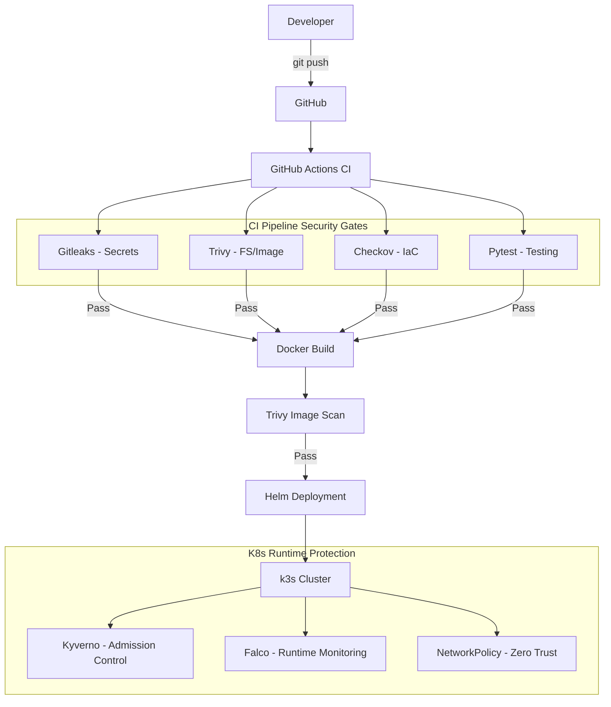

# Project Architecture

## High-Level Flow

## Component Breakdown

### 1. Application Layer
- **FastAPI**: High-performance Python service.
- **Metrics/Health**: Instrumented with Prometheus-style metrics and deep health checks.

### 2. Infrastructure as Code (IaC)
- **Terraform**: Skeletons for Yandex Cloud (VPC, Instances).
- **Ansible**: Automated k3s installation and node configuration.

### 3. CI/CD & Security Automation
- **GitHub Actions**: Integrated pipeline for continuous verification.
- **Scan Script**: `scripts/scan.sh` provides a local mirror of CI security checks.

### 4. Kubernetes Security & Governance
- **Kyverno**: Enforces "Secure by Default" (no privileged containers, require non-root).
- **Falco**: Detects shell execution in containers or unusual file access at runtime.
- **NetworkPolicy**: Implements micro-segmentation to limit lateral movement.

### 5. Observability
- **Prometheus**: Scrapes application metrics via ServiceMonitor.
- **Grafana**: Visualizes telemetry using the pre-built `monitoring/grafana-dashboard.json`.
