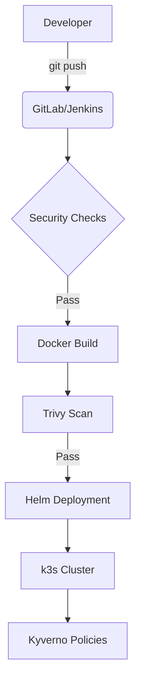

# Project Architecture

## High-Level Flow

## Component Breakdown
- **App**: FastAPI based microservice.
- **IaC**: Terraform for cloud provisioning, Ansible for k3s setup.
- **Orchestration**: Helm charts with SecurityContext and resource limits.
