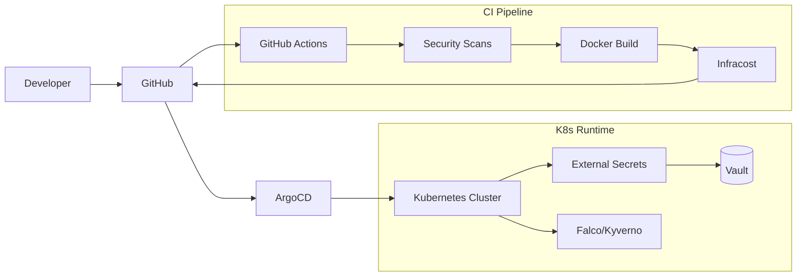
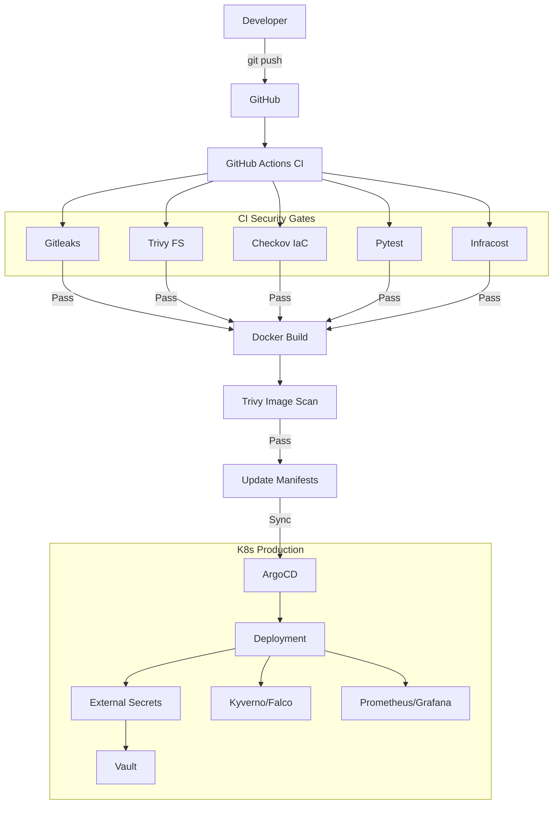

# Documentation Refresh Implementation Plan

> **For agentic workers:** REQUIRED SUB-SKILL: Use superpowers:subagent-driven-development (recommended) or superpowers:executing-plans to implement this plan task-by-task. Steps use checkbox (`- [ ]`) syntax for tracking.

**Goal:** Update `README.md`, `docs/architecture.md`, and `terraform/README.md` to reflect recent feature additions (ArgoCD, ESO, Infracost, Pre-commit).

**Architecture:** Update Mermaid diagrams and add descriptive sections for the new components to provide a comprehensive overview of the DevSecOps portfolio.

**Tech Stack:** Markdown, Mermaid.

---

### Task 1: Update README.md

**Files:**
- Modify: `README.md`

- [ ] **Step 1: Update Architecture Mermaid diagram**

Update the diagram to include ArgoCD, ESO, and Vault.



- [ ] **Step 2: Update Project Structure section**

Add `argocd/` and `security/` to the list.

- `argocd/`: GitOps application manifests for ArgoCD.
- `security/`: Configuration for Falco rules, Gitleaks, and quality gates.

- [ ] **Step 3: Update Key Features section**

Add ArgoCD, ESO, and Infracost.

- **GitOps Deployment**: **ArgoCD** automates deployment and ensures the cluster state matches the repository.
- **Secret Management**: **External Secrets Operator (ESO)** fetches sensitive data from external providers like HashiCorp Vault.
- **Cost Management**: **Infracost** provides cloud cost estimates directly in the CI pipeline for "Shift Left" financial visibility.

- [ ] **Step 4: Add Pre-commit Hooks to Usage section**

```bash
### Pre-commit Hooks
Install pre-commit hooks to ensure code quality and security checks run before every commit:
```bash
pip install pre-commit
pre-commit install
```
```

- [ ] **Step 5: Verify rendering and commit**

```bash
git add README.md
git commit -m "docs: update README with ArgoCD, ESO, Infracost, and pre-commit"
```

---

### Task 2: Update docs/architecture.md

**Files:**
- Modify: `docs/architecture.md`

- [ ] **Step 1: Update High-Level Flow Mermaid diagram**

Provide a more detailed view of the DevSecOps lifecycle.



- [ ] **Step 2: Update Component Breakdown**

Add ArgoCD, ESO, and Infracost sections.

- **GitOps (ArgoCD)**: Implements continuous delivery by syncing Helm charts from `helm/` to the cluster.
- **Secret Management (ESO)**: Decouples secrets from application manifests, fetching them at runtime from a secure backend.
- **Cost Estimation (Infracost)**: Integrated into CI to provide visibility into infrastructure cost changes.

- [ ] **Step 3: Verify and commit**

```bash
git add docs/architecture.md
git commit -m "docs: update architecture.md with detailed GitOps flow"
```

---

### Task 3: Update terraform/README.md

**Files:**
- Modify: `terraform/README.md`

- [ ] **Step 1: Add Infracost note**

Add a note about cost estimation.

```markdown
## Cost Management

This project uses **Infracost** in the GitHub Actions pipeline to estimate the cost of infrastructure changes defined in these Terraform manifests. This allows for "Shift Left" cost visibility before resources are provisioned.
```

- [ ] **Step 2: Commit**

```bash
git add terraform/README.md
git commit -m "docs: add Infracost note to terraform README"
```
